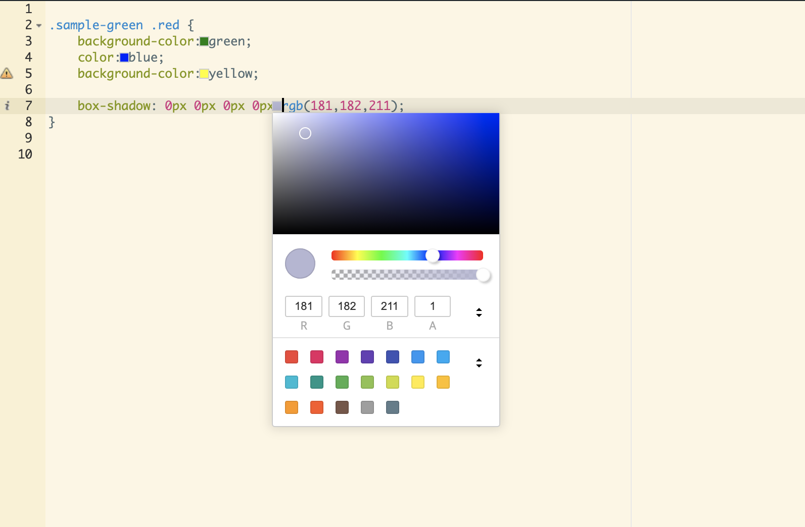

# Colorpicker for ACE Editor


This project was created to implement a color picker. It implemented basic functions for color and implemented image filters.


[](https://opensource.org/licenses/MIT)

[](https://www.jsdelivr.com/package/npm/ace-colorpicker)

[](https://npmjs.org/package/ace-colorpicker)


# Sample Image 




# Install 

## npm 

```npm
npm install ace-colorpicker
```

# How to use (for  browser) 

```
<link rel="stylesheet" href="https://cdn.jsdelivr.net/npm/ace-colorpicker@0.0.12/addon/ace-colorpicker.css" />
<script type="text/javascript" src="https://cdn.jsdelivr.net/npm/ace-colorpicker@0.0.12/addon/ace-colorpicker.min.js" ></script>     
```

# How to use (for es6) 

```js

import AceColorPicker from 'ace-colorpicker'; 

```


## Apply colorpicker 

```html

<script type="text/javascript" src="https://ajaxorg.github.io/ace-builds/src/ace.js"></script> 

<link rel="stylesheet" href="https://cdn.jsdelivr.net/npm/ace-colorpicker@0.0.12/addon/ace-colorpicker.css" />
<script type="text/javascript" src="https://cdn.jsdelivr.net/npm/ace-colorpicker@0.0.12/addon/ace-colorpicker.min.js" ></script>     

<script type="text/javascript">

var editor = ace.edit("sample_text_area");
editor.setTheme("ace/theme/solarized_light");    
editor.session.setMode("ace/mode/css", () => {
  AceColorPicker.load(ace, editor, { ....options });
})


</script>

```

# Color code target 

token with `ace_color` class name 


# Support Mode 

* ace/mode/css
* ace/mode/less
* ace/mode/scss

# Options 

### hideDelay 

Sets the delay time applied when the popup is closed. unit of ms

```js
AceColorPicker.load(ace, editor, { 
  hideDelay: 1000
})
```

### showDelay 

Sets the delay time for opening the color picker. The default is 300ms.

The colorpicker opens only when the mouse is in the same place during the showDelay time.

```js
AceColorPicker.load(ace, editor, { 
  showDelay: 1000
})
```

# Developments 

## local dev 

```
git clone https://github.com/easylogic/ace-colorpicker
cd ace-colorpicker
npm install 
npm run dev 
open localhost:10001 
```

## build 

```
npm run build 
```

# License : MIT 
